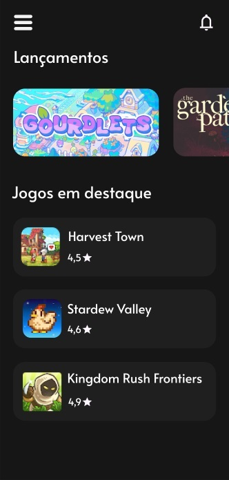

# Game Store

## Fonte utilizada

<h3 style="font-family: 'Alata', sans-serif;">Google fonts: Alata</h3>

## Paleta de cores

## Objetivo do Projeto

O **Game Store** é um aplicativo que permite aos usuários explorar e visualizar informações detalhadas sobre jogos móveis. Ele apresenta uma interface moderna com seções para lançamentos, jogos em destaque e uma página detalhada sobre cada jogo. O objetivo é fornecer uma experiência fácil e visualmente atraente para os usuários navegarem e descobrirem novos jogos.

## Funcionalidades do Aplicativo

### 1. Login de Usuário
- Tela inicial permite que o usuário faça login utilizando um endereço de e-mail.
- Caso o usuário não tenha cadastro, há um link para a criação de uma nova conta.

### 2. Lançamentos
- Uma seção especial na página inicial destaca os **Lançamentos** recentes de jogos.
- Jogos recentes são exibidos em forma de carrossel, permitindo que o usuário deslize horizontalmente para ver os títulos mais novos.

### 3. Jogos em Destaque
- Abaixo dos lançamentos, uma lista de **Jogos em Destaque** é exibida.
- Para cada jogo, são apresentados:
    - **Nome do jogo**
    - **Rating (avaliação)**
    - **Imagem em miniatura**

### 4. Detalhes do Jogo
- Ao clicar em um jogo da lista de destaque, o usuário é direcionado para uma tela de detalhes do jogo, onde pode visualizar:
    - **Imagem destacada**: Grande imagem do jogo.
    - **Nome do Jogo**
    - **Rating**: Avaliação do jogo exibida com estrelas.
    - **Downloads**: Número estimado de downloads, por exemplo, "5M+".
    - **Categoria**: Tipo de jogo, como "RPG", "Aventura", etc.
    - **Descrição do jogo**: Uma breve sinopse do jogo explicando os principais aspectos.
    - **Botão de Saiba Mais**: Um botão que pode redirecionar para mais informações ou até mesmo para o download do jogo.

### 5. Menu Lateral
- Um **menu hambúrguer** no canto superior esquerdo oferece navegação entre diferentes seções do aplicativo.

### 6. Notificações
- Há um ícone de sino no canto superior direito para notificações, que pode alertar os usuários sobre novidades e novos lançamentos.

## Estrutura de Dados dos Jogos

Cada jogo será representado pelos seguintes dados:
- **Nome**: Nome do jogo.
- **Sobre**: Breve descrição do jogo.
- **Imagem (img)**: Imagem principal do jogo usada na tela de detalhes.
- **Miniatura (thumb)**: Miniatura do jogo exibida nas listas.
- **Rating**: Avaliação média do jogo, representada em estrelas.
- **Downloads**: Número de downloads estimado.
- **Categoria**: Tipo de jogo (RPG, Aventura, etc.).

## Seções e Telas

### Tela de Login
- **Campos**: Entrada de e-mail e botão de login.
- **Ação**: Se o usuário não tiver cadastro, há um link para redirecionar para o processo de criação de conta.

### Tela Inicial (Home)
- **Lançamentos**: Apresentação de jogos lançados recentemente em um formato de carrossel.
- **Jogos em Destaque**: Lista de jogos populares com suas respectivas avaliações.

### Tela de Detalhes do Jogo
- **Imagem em Destaque**: Imagem principal do jogo.
- **Informações Gerais**: Avaliação, downloads e categoria do jogo.
- **Sobre**: Descrição do jogo.
- **Botão "Saiba mais"**: Botão de navegação para mais detalhes ou uma possível ação como download.

### Menu Lateral
- Acessado através do ícone de hambúrguer, oferece navegação entre diferentes partes do aplicativo (exemplo: home, perfil, configurações).

### Notificações
- Acessível pelo ícone de sino, mostra as notificações recentes.

## Tecnologias Utilizadas

- **Flutter**: Framework usado para construir a interface do aplicativo.
- **Firebase**: Utilizado para autenticação de usuários (login) e para armazenar os dados de jogos.
- **Provider**: Utilizado para gerenciar o estado do aplicativo e conectar a View com a ViewModel.

## Possíveis Melhorias Futuras

1. **Sistema de Favoritos**: Permitir que os usuários salvem jogos em uma lista de favoritos.
2. **Recomendações**: Implementar um sistema de recomendações baseado nos jogos que o usuário já visualizou.
3. **Comentários e Avaliações de Usuários**: Permitir que os usuários deixem suas próprias avaliações e comentários sobre os jogos.
4. **Filtro de Jogos**: Adicionar filtros por categoria, como RPG, Aventura, Estratégia, etc.

## Estrutura de Pastas do Projeto

Este projeto segue o padrão de arquitetura **MVVM (Model-View-ViewModel)** para organizar o código de maneira modular e escalável. Abaixo está a descrição da estrutura de pastas utilizada no aplicativo **Catálogo de Jogos**:

### Descrição das Pastas

- **/models**:
    - Contém as classes de modelo que representam os dados do jogo. O arquivo `game.dart` define as propriedades do jogo (nome, imagem, categoria, downloads, etc.) e métodos para manipulação desses dados.

- **/viewmodels**:
    - Gerencia a lógica de apresentação e o estado da aplicação. O arquivo `game_view_model.dart` contém operações como buscar, adicionar, atualizar e excluir jogos no banco de dados (Firebase Firestore).

- **/views**:
    - Contém as telas e widgets que compõem a interface do usuário. O arquivo `game_list_screen.dart` exibe a lista de jogos, enquanto `game_form_screen.dart` oferece uma interface para adicionar ou editar um jogo.

- **/services**:
    - Serviços de interação com APIs e banco de dados. O arquivo `firestore_service.dart` gerencia as operações de leitura e gravação no Firebase Firestore.

- **main.dart**:
    - Arquivo principal que inicializa o aplicativo, configura o Firebase e define a tela inicial.

### Versões do Framework

- **Flutter**:
  - 3.24.3.

- **Dart**:
  - 3.5.3.